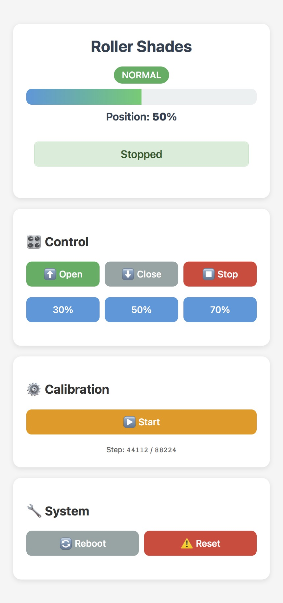

# Roller Shades Controller (ESP32 + HomeKit)

ESP32-based roller shades controller for the Seeed XIAO ESP32C6 (or any ESP32 variant) with native HomeKit via HomeSpan, two-button control, a lightweight web UI, and persistent calibration.

## Features

- Native HomeKit WindowCovering service (no bridge required) with live position feedback
- Web UI on port 8080 for control, calibration, pairing code display, reboot/reset
- Two physical buttons with smooth stop, calibration, and factory reset
- Smooth stepper motion using AccelStepper; holds torque optionally after moves
- Status LED with movement brightness and calibration/uncalibrated blink
- Calibration persists to LittleFS (`/config.json`); HomeKit data stored in NVS

## Hardware

- Seeed Studio XIAO ESP32-C6 (or any ESP32 variant supported by HomeSpan)
- 28BYJ-48 stepper (5V or 12V variant) + ULN2003 driver (5–12V compatible)
- Two momentary buttons (UP/DOWN)
- Built-in status LED on GPIO15 (active-low, PWM)
- 3D printed parts: [Smart Roller Shades (ESP32 HomeKit) on Printables](https://www.printables.com/model/1524947-diy-roller-shades-homekitwebui-esp32)

> Recommended: 12V motor + 12V PSU 2A for better torque, and a buck converter (12V→5V) to power the ESP32/XIAO. Common GND required.
> Power note: Do not feed external 5V into XIAO VBUS while also connected to USB. If using a 12V PSU, power motor/ULN2003 from 12V and use a buck converter (12V→5V) for the ESP32/XIAO, sharing a common GND.
> Build note: In my case, all parts fit inside the printed enclosure except the power supply.
> **Pinout (see `pins.h`):**

- Motor: IN1=GPIO1, IN2=GPIO2, IN3=GPIO21, IN4=GPIO22
- Buttons: UP=GPIO19, DOWN=GPIO20
- Status LED: GPIO15 (built-in, active-low PWM)
- XIAO map: D1=GPIO1, D2=GPIO2, D3=GPIO21, D4=GPIO22, D8=GPIO19, D9=GPIO20

## Firmware Setup

1. Install ESP32 board package in Arduino IDE or CLI (Board Manager URL: `https://espressif.github.io/arduino-esp32/package_esp32_index.json`).
2. Select board **XIAO_ESP32C6** (or your ESP32), partition scheme **Minimal SPIFFS (1.9MB APP with OTA/190KB SPIFFS)**.
3. Install libraries: HomeSpan (2.1+), AccelStepper (1.64+), EasyButton (2.0.3+), ArduinoJson (6.21+).

   ```bash
   arduino-cli lib install "HomeSpan" "AccelStepper" "EasyButton" "ArduinoJson"
   ```

4. Build/flash:

   ```bash
   arduino-cli compile --fqbn esp32:esp32:XIAO_ESP32C6:PartitionScheme=min_spiffs .
   arduino-cli upload   --fqbn esp32:esp32:XIAO_ESP32C6:PartitionScheme=min_spiffs -p /dev/ttyUSB0 .
   ```

## First Boot & Pairing

- On first boot or after factory reset, HomeSpan starts a setup AP **RollerShades-Setup** for Wi‑Fi provisioning (no WiFiManager needed).
- Once on Wi‑Fi, open the web UI at `http://<device-ip>:8080` (or the mDNS host advertised by HomeSpan) for control and status.
- Home app → Add Accessory → More Options → pick **Roller Shades** → enter setup code **281-42-814**.

## Operation

**Physical buttons (ignored for 10s after boot to avoid accidental presses):**

- UP short: move to 100% (open)
- DOWN short: move to 0% (close)
- UP+DOWN short: smooth stop
- UP+DOWN 5s: enter calibration
- UP+DOWN 10s: factory reset (wipes Wi‑Fi, HomeKit, config)

**Web UI (port 8080):**

- Open/Close/Stop and 30/50/70% presets
- Start/exit calibration, save top/bottom points, view travel and status message
- Shows HomeKit code when the accessory is unpaired
- Reboot or factory reset



### Screenshot: web UI (click to view full size)

**Status LED (built-in, GPIO15 active-low PWM):**

- Slow blink (~400ms) during calibration or when not yet calibrated
- Brighter while moving, dimmer when idle
- Five quick flashes confirm calibration saves

## Calibration Flow

1. Enter calibration (UP+DOWN 5s or web “Start”). LED blinks.
2. Toggle jog with single presses: UP toggles upward motion, DOWN toggles downward; STOP via UP+DOWN or web Stop.
3. Move to fully open (top) and short-press UP+DOWN to save top.
4. Move to fully closed (bottom) and short-press UP+DOWN to save bottom. Travel must exceed `MIN_TRAVEL` (4096 steps) or save is rejected.
5. Controller rebases zero, saves `/config.json`, blinks confirmation, and returns to normal mode.

## Configuration

**Motion constants (`shades_homekit_esp32.ino`):**

```cpp
const float SPEED_MAX = 900.0f;      // steps/s
const float ACCEL = 300.0f;          // steps/s^2
const float CAL_SPEED = 300.0f;      // calibration speed
const int32_t HOLD_TORQUE_MS = 3000; // -1=always hold, 0=drop immediately
const int MIN_TRAVEL = 4096;         // minimum calibration distance
```

**Pins:** editable in `pins.h`.
**Storage:** `/config.json` on LittleFS (position, travel, raw calibration points, target). Factory reset formats LittleFS and clears HomeKit pairing (NVS).
**Debug:** define `SHADES_DEBUG` (see `Globals.h`) for serial logging.

## OTA Updates

After the first serial flash, firmware can be updated over WiFi (OTA) using HomeSpan's built-in OTA support.

- **OTA password:** `28142814` (same as HomeKit pairing code)
- In Arduino IDE: the device appears as a network port under Tools → Port → Network ports
- Via CLI: `arduino-cli upload --fqbn esp32:esp32:XIAO_ESP32C6:PartitionScheme=min_spiffs --port <device-ip> .`
- **Note:** The first flash after changing partition scheme must be done via USB serial.

## Troubleshooting

- No movement: check ULN2003 wiring/power, ensure calibration completed, enable `SHADES_DEBUG` for logs.
- HomeKit fails to pair: remove old accessory in Home app, hold UP+DOWN 10s to factory reset, then re-pair with code 281-42-814.
- Wi‑Fi issues: power-cycle; if the setup AP does not appear, factory reset and reconfigure Wi‑Fi.

## License & Credits

- MIT License
- Thanks: [HomeSpan](https://github.com/HomeSpan/HomeSpan), [AccelStepper](http://www.airspayce.com/mikem/arduino/AccelStepper/), [EasyButton](https://github.com/evert-arias/EasyButton), [ArduinoJson](https://arduinojson.org/).
